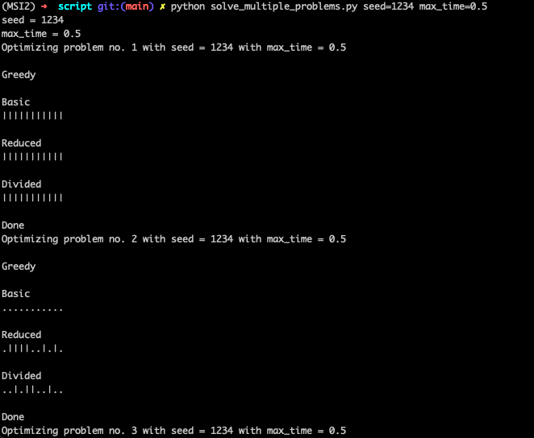
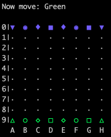

# MSI2
Repository for the projects of Artificial Intelligence Methods 2 - the course in MiNI WUT.

Feel free to open the Issue in case of any problems with the source

## Project 1 - Solving CVRP problem with Ant Colony algorithm
All documents (Conspectus, Report and presentation) are available in the `project1/documents` folder.

### Reproduction of the results
1. Clone this repository
2. Open the folder `project1/src/AntColony`
3. Run the command: `pip install .`

After that, One has the `AntColony` package installed in one's Python. Now One can:

1. Run the Jupyter Notebooks from the folder `project1/src/JupyterNotebooks`
2. Run the script from `project1/src/scripts` with the commend ` Python solve_multiple_problem.py`

After initializing the script, one should see something like this:

The pipe (|) means that the found solution was better than the greedy solution. The dot (.) means that the found solution was worse than the greedy solution.

The script `solve_multiple_problem.py` has some parameters. One can inspect them with `python solve_multiple_problem.py help`

In the Report, the script was executed with `max_time=300` and `number_of_repetitions=11`, which results with approximately 16 and a half hours of computing (300 seconds * 11 number\_of\_repetitions * 6 datasets * 3 modifictions = 16.5 hours).

## Projekt 2 - Zastosowanie Upper Confidence Bound Applied To Trees do stworzenia sztucznej inteligencji grającej w Taifho dla dwóch graczy

1. We can gen into the same board in 2 different way. Should we remember this after the move?
2. Shold we select moves uniformly? Or maybe we will prefer those that leads to pawns being further?

### Jak zagrać z SI?
1. Pobierz to repozytorium
2. Przejdź do folderu `project2/src/Taifho`
3. W Terminalu wpisz komendę: `pip install .`
4. Włącz interpreter Python albo za pomocą `jupyter notebook`, bądź komendą `python`.
5. Zaimportuj zainstalowaną bibliotekę: `import Taifho`
6. TODO(Co dalej?)

Pozycja startowa:

